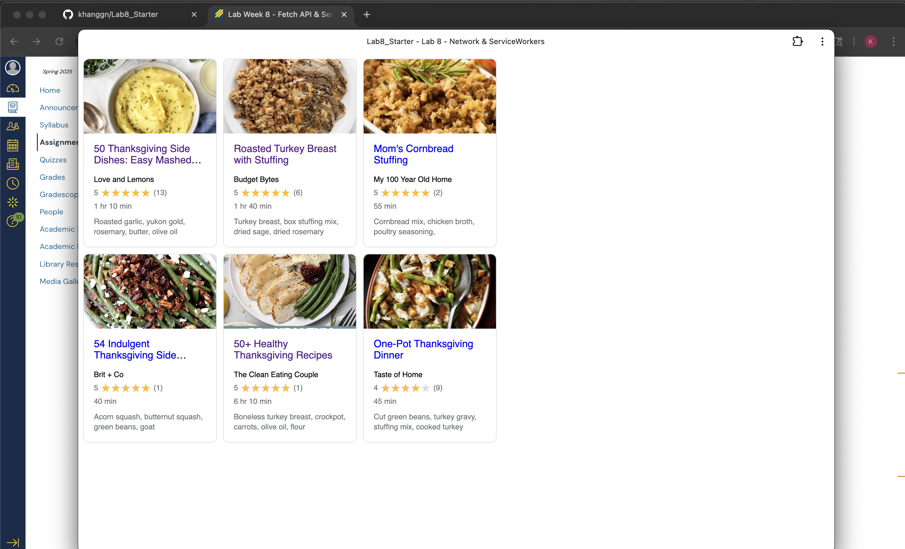

# Lab8-Starter

How are graceful degradation and service workers related? 
- Service workers are background scripts with a purpose of proxing between the web app and the network. SW lets us control how the network request are controlled. This allows us to cache files and then serve them when users are offline. Graceful degradation is a design principle where when we are trying to build some kind of application that works on new browsers. We also ensure that the app falls back to a limited version in older browser that don't support those features. Pretty much the core functionality works on older browser even if some features aren't avalible. Again, these two are related as service workers directly enable graceful degradtion by allowing web apps to function even when offline. 

Screenshot of pwa.png

[Link to GitHub Pages](https://khanggn.github.io/Lab8_Starter/)